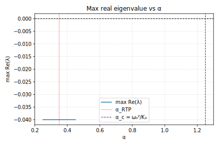
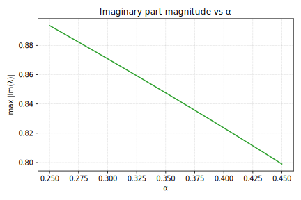
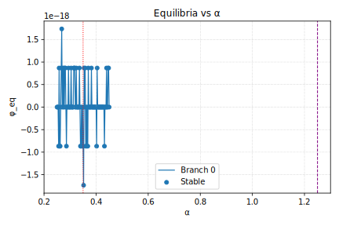

# Equilibrium Analysis (Non-Hopf RTP)

No eigenvalue crossing; max Re(λ) ≈ -0.04 near α ≈ 0.35; Hopf ruled out. α_c = ω₀²/K₀ = 1.25; RTP happens far before local instability—global/curvature mechanism.

## Key Metrics

| Quantity | Value |
| --- | --- |
| Scan range | α ∈ [0.25, 0.45] (Δα = 0.002) |
| max Re(λ) | -0.0400 at α = 0.250 |
| α_RTP (hint) | 0.350 |
| α_c = ω₀²/K₀ | 1.250 |
| Stable equilibria | 101 / 101 |
| Parameters | ω₀ = 1.000, γ = 0.080, K₀ = 0.800 |

## Figures

## Reproduction

1. `python scripts/analysis/equilibrium_eigs_scan.py`
2. `python scripts/analysis/render_equilibrium_report.py`

CSV/JSON outputs live in `results/equilibrium/` and figures under `docs/assets/figures/`.
